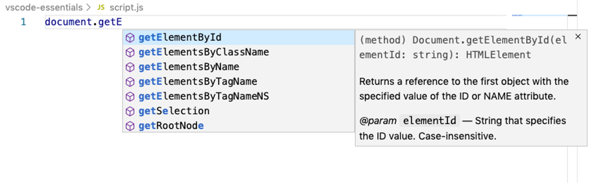

# VS Code Essentials

## User Interface

1. command b toggles the file explorer
2. Information about the enchoding lines and columns shown botom
3. command shift f - search
4. command shift x - extensions
5. control shift g - source control
6. command shift d - debugging
7. control ~ for hiding and showing terminal window
8. command shift p - command pallette
9. zen mode

## split editor

1. grid system avaialble to open editors in the view you need them
2. ctrl and number to navigate between tab groups
3. ctrl shift tab to navigate between tabs
4. single click opens the file in soft mode, you will have indication as well as the file name is displayed in italics
4. command p to open file
5. command w will close current file
6. workspace file inside the project folder to have vs code configuraitions
7. commond - up arrow to move to top of the code
8. command - down arrow to move to bottom of the code
9. hold option and then arrows will help you to navigate between word by word than character by character
10. command d helps to select the complete word
11. holding option and using up and down arrow will move the line to the top or bottom
12. option shift and up/down arrow will duplicate the same line
13. command x and command v on the line ... does copy, cut paste
14. you repeatedly presse command d it selects all the words and with mulitple cursors and then you can retype it as you need
15. option click to include multiple cursors
16. command option shift up and down to have multi cursor shown
17. command f search with in file
18. command shift f search in folders
19. command shift h open search along with replace menu
20. intellisense 


## Emmet

1. ! for html
2. css type of selectors for remaining
3. $ for index
4. //* for multiplicaton
5. nested condition possible

## Keyboard shortcut updates
-----

1. We have ability to change VS code keyboard texts
2. if you are used to some other editor like sublime or atom etc... you can use key map extensions to get the same hot key experieince on vs code.
3. keybindings.json
   

## settings

---
1. command + , for settings
2. custmize suttings for user/workspace
3. using font - ligatures //
4. FIRA CODE
5. font ligatures handling symbols
6. /* npm scripts /* outline */
  

  ## extensions

  ----
1. rainbow brackets
2. Quokka for real time output
3. polacode for caputring screen shots
4. advance new file to create file with required name and path
5. auto clase tag lite
6. liveserver is very useful extension to open file inside of browser and auto update
7. open in browser 
8. vs code icons for cool effect
9. better comments for color indidcaiotn
10. es6 extensions
11. search node_modules for sering node modules
12. import cost /// indicates the cost of import size
13. dotENV for coloring env files
14. intell-sense provides classes available inside the css file
15. todo highilght
16. ES7 react/redux/vetur ... etc. snippets extensions
17. vetur
18. angular snipptes v8
19. project manager for organizing projects
20. editorconfig
21. eslint
22. settins sync
23. git lens
24. settings sync - to save vs code settins on github or some other plance so you dont have to open it again
    


 ## themes
 ---

1. cobalt 2
2. shades of purple
3. Night owl
4. one dark pro
5. material icon theme
6.  material theme
7.  dracula official
8.  /* best theme extensoins */

## snippets

----

1. useful feature to have snippets
   ```

   {
	"Print to Console":{
		"prefix":"clog",
		"body":"console.log('$1');\n$0",
		"description": "Log content to console"
	} ,
	"JQ For Loop in Array":{
		"prefix": "jqforarr",
		"body":[
			"for (let $index = 0; $index<${array}.length; $index++){",
				"\tconst $element = $array[$index]",
				"\t$0",
			"}"		
		]	
	}
}

we also have lot of snippet extensions

## markdown
---

Userful extensions
markdown lint
markdown shortcuts
markdown toc

## organize code

---

commenting short cut
<!-- toogle comment on that line -->

command ?

shift alt f for formating document

format on save option is enabled
editorconfig is excellent

prettier

https://prettier.io/

recommend to install inside the project

/** prettier rc***/
/** es lint***/

ESLINT


/**
Formatting
**/

## terminal

----


we can hav  multiple termial split windows


/* mark down reference available in udemy */

terminal settins are available

terminal rename for mongoDB .. ssh can re renamed

frontend
short  cut for terminal focus

## git extensions

1. git history extension
2. git blame - to blame who has done that code change


## debugging

Debugger forchrome

